# blogs-admin 项目简介

---

目前开发任务不是很多，所以想抽空开发一个自己的博客，此项目是博客后台管理系统仓库，使用vue3+vite开发，后台服务使用nodejs+express+mysql完成，博客前端页面和前端接口待开发......

### 项目接口服务

---

<a href="https://github.com/chend1/blogs-api" target="_blank">接口服务源码地址</a>

---

### 项目功能

- [x] 登录
- [x] 路由拦截
- [x] 账号（用户）管理
- [x] 菜单管理
- [x] 角色管理
- [x] 首页数据分析
- [x] 文章管理
- [x] 评论管理
- [x] 分类管理
- [x] 标签管理
- [x] 友情链接管理
- [x] 资源管理
- [x] 游客管理
- [x] 留言咨询

### 项目部分预览

<table>
  <tr>
    <td>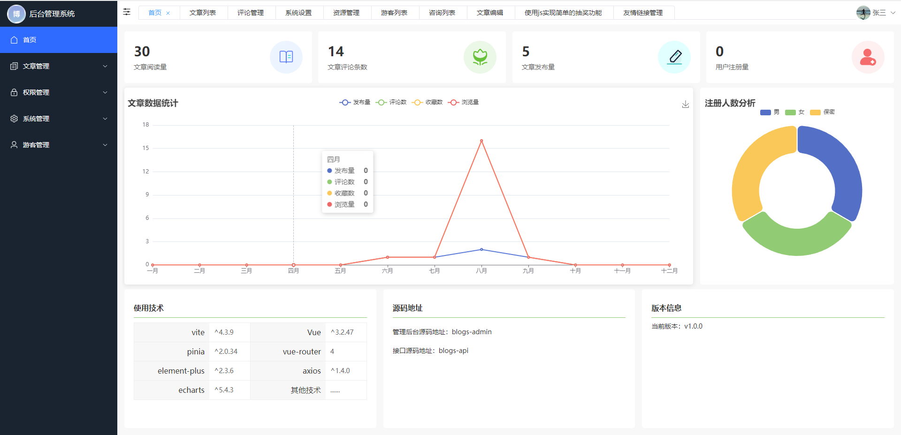</td>
    <td>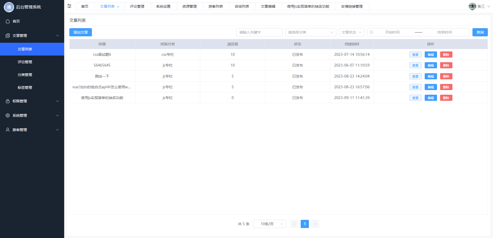</td>
    <td>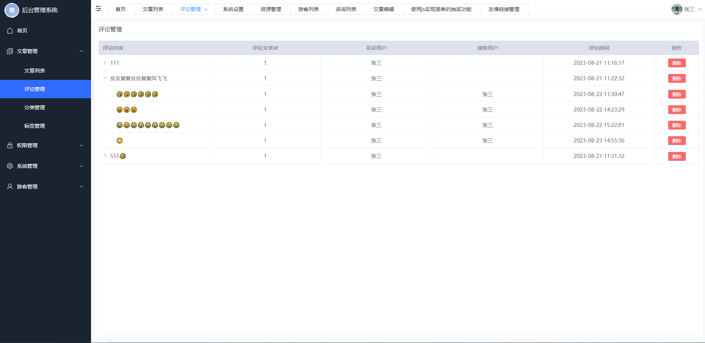</td>
  </tr>
  <tr>
    <td>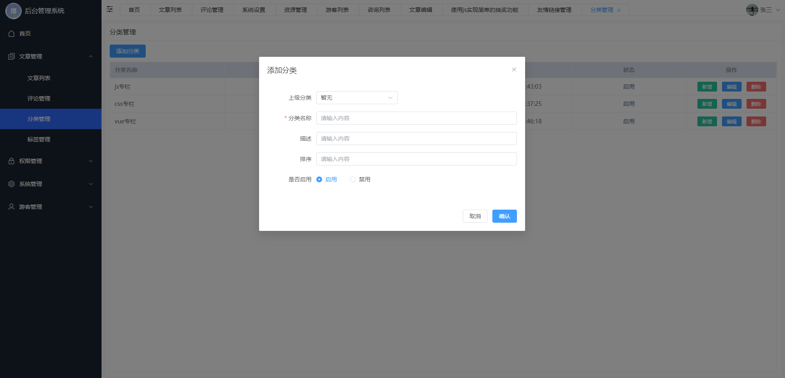</td>
    <td>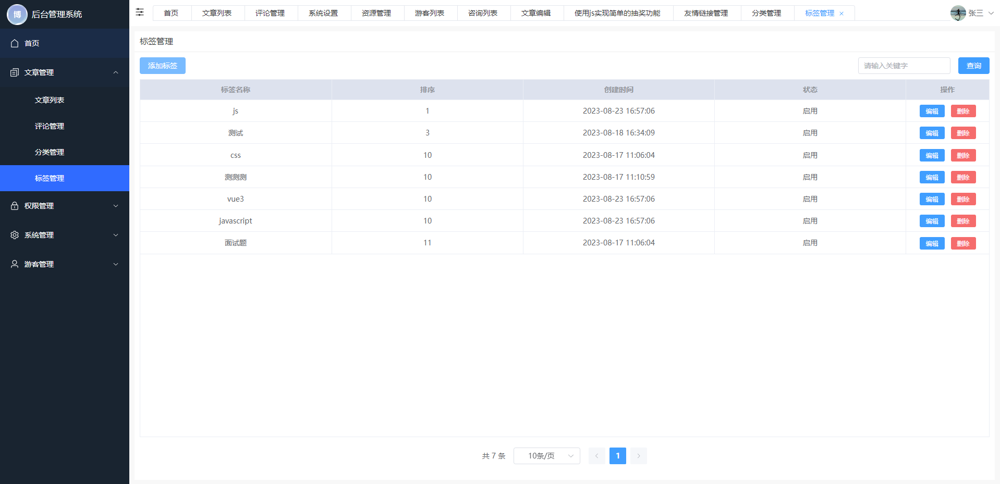</td>
    <td>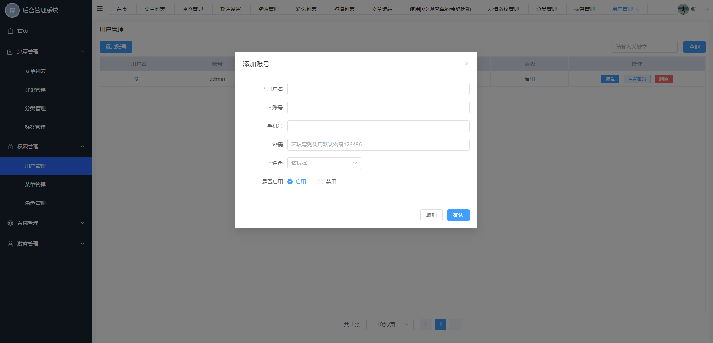</td>
  </tr>
  <tr>
    <td>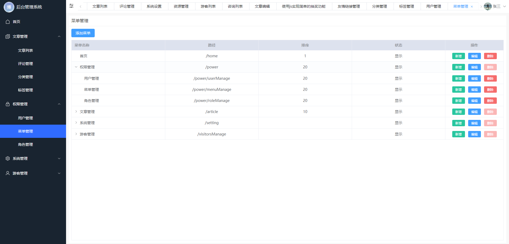</td>
    <td>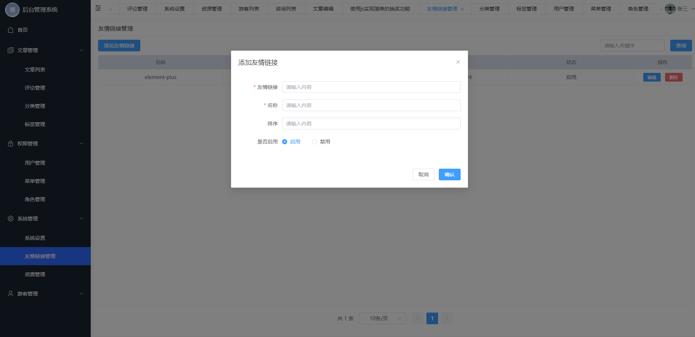</td>
    <td>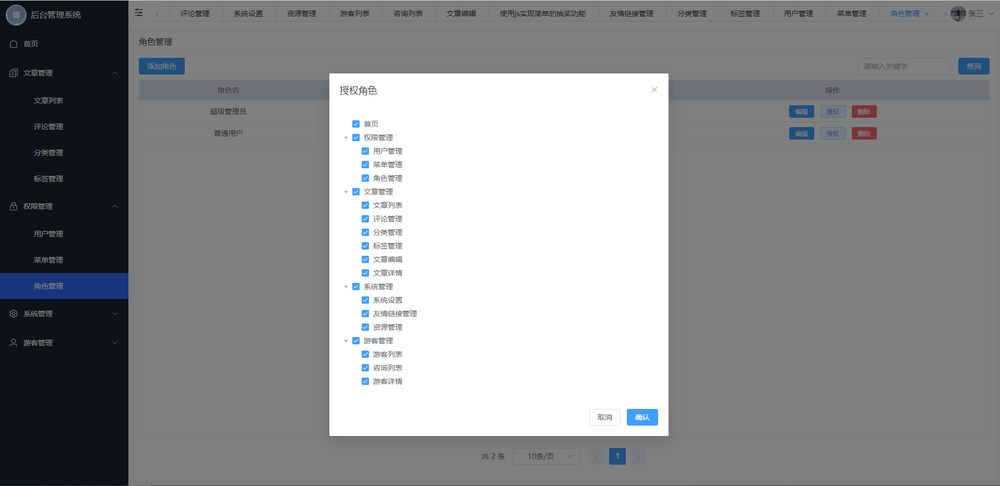</td>
  </tr>
  <tr>
    <td>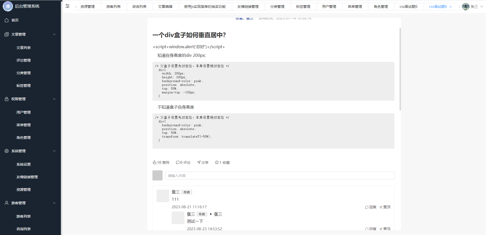</td>
    <td>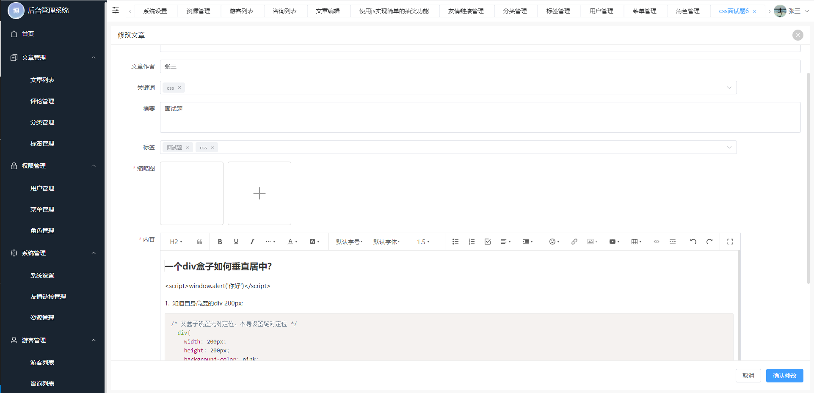</td>
    <td>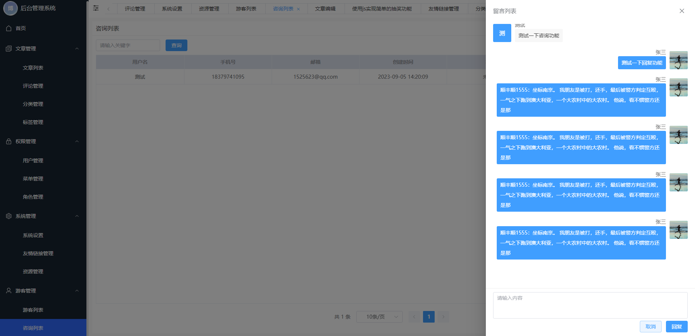</td>
  </tr>
</table>

### 项目启动

```javascript
pnpm install
pnpm dev
```